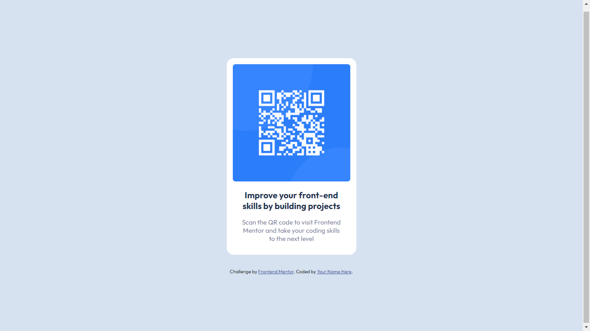

# Frontend Mentor - QR code component solution

This is a solution to the [QR code component challenge on Frontend Mentor](https://www.frontendmentor.io/challenges/qr-code-component-iux_sIO_H). Frontend Mentor challenges help you improve your coding skills by building realistic projects.\

## table of contents

- [Overview](#overview)
  - [Screenshoot](#screenshoot)
  - [Links](#links)
- [Author](#author)
- [Build With](#build-with)
- [Special Thanks](#special-thanks)

## Overview

### Screenshoot

:desktop_computer: Desktop Version :

:computer: Mobile Version :

## Links

Live Site : (https://salmanalfarisy.github.io/QR-code-component-challenge/)

## Built with

- Tag Semantic HTML
- CSS Custom with Variable
- Layout Flexbox

## Author

- FrontEnd Mentor :sunglasses: - [@SalmanAlfarisy](https://github.com/SalmanAlfarisy) :wave:

## Special Thanks

thank you :revolving_hearts: for [Frontend Mentor](https://www.frontendmentor.io/) for organizing front end challenge I will always follow every challenge given by frontend mentor.
